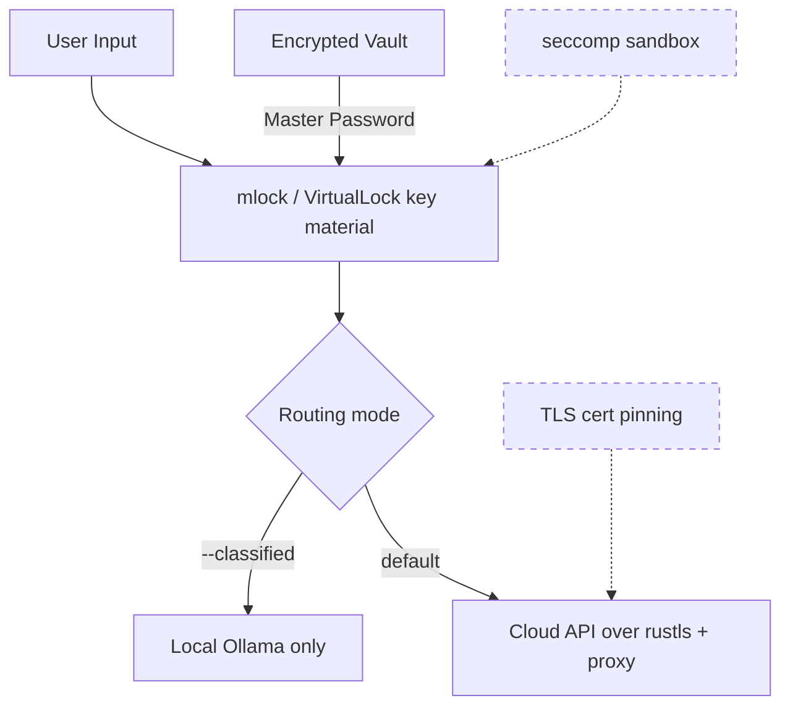

# Security Schema (as built)
Dashed nodes are **not implemented** — see `22_status.md`.

```mermaid
flowchart TD
    A[User Input] --> C[mlock / VirtualLock key material]
    C --> D{Routing mode}
    D -- "--classified" --> E[Local Ollama only]
    D -- "default" --> F[Cloud API over rustls + proxy]
    G[Encrypted Vault] -- "Master Password" --> C
    B:::todo -.-> C
    H[TLS cert pinning]:::todo -.-> F
    classDef todo stroke-dasharray: 5 5
    B[seccomp sandbox]
```
