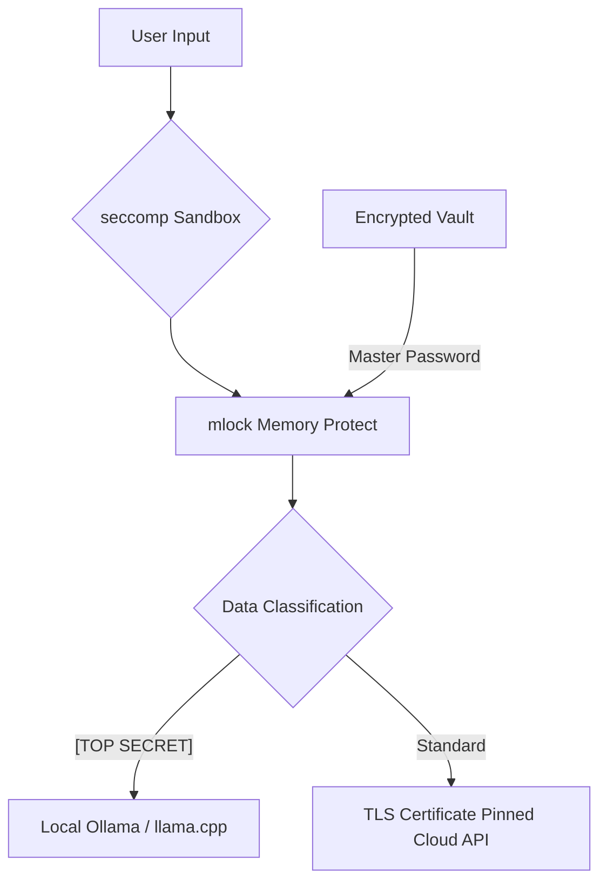

# Military-Grade Security Schema

```mermaid
flowchart TD
    A[User Input] --> B{seccomp Sandbox}
    B --> C[mlock Memory Protect]
    C --> D{Data Classification}
    D -- "[TOP SECRET]" --> E[Local Ollama / llama.cpp]
    D -- "Standard" --> F[TLS Certificate Pinned Cloud API]
    G[Encrypted Vault] -- "Master Password" --> C
```
